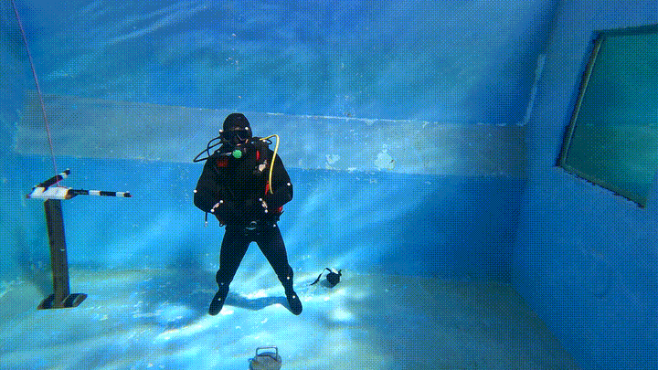
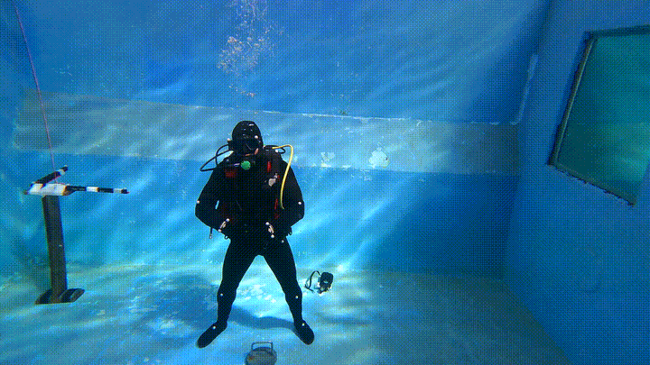

# DTW_KNN

This  github repository is associated with the paper :"Subject-independent diver gesture classification using upper limb movement" submitted to the journal Robotics and Automation Letter and currently under review.

  

This repository is organized as follow: 

+./env/ directory contains files required to replicate the python environment
+ ./data/ directory that contains the data used in the paper. 
+ ./DTW-KNN/ include for the DTW classification.
 The DTW-KNN code is partially based on the code present in two following repositories:
 https://github.com/markdregan/K-Nearest-Neighbors-with-Dynamic-Time-Warping/
 https://github.com/kamperh/lecture_dtw_notebook 

<!-- 
*out of air* -->

The 11 gestures classified in this paper :

    <!-- First Row: 3 GIFs -->
    <figure >
        
        <figcaption>out of air</figcaption>
    </figure>
    <figure >
        
        <figcaption>Assemble</figcaption>
    </figure>
    <figure >
        
        <figcaption>Cold</figcaption>
    </figure>
    <figure >
    <!-- Second Row: 3 GIFs -->
        
        <figcaption>Go down</figcaption>
    </figure>
    <figure >
        
        <figcaption>Go up</figcaption>
    </figure>
    <figure >
        
        <figcaption>Half-pressure</figcaption>
    </figure>
    <figure >
    <!-- Third Row: 3 GIFs -->
        
        <figcaption>Not well</figcaption>
    </figure>
    <figure >
        
        <figcaption>Ok</figcaption>
    </figure>
    <figure >
        
        <figcaption>Panting</figcaption>
    </figure>
    <!-- Fourth Row: 2 GIFs -->
    <figure >
        
        <figcaption>Reserve</figcaption>
    </figure>
    <figure >
        
        <figcaption>Stabilize</figcaption>
    </figure>

## Step 1 replicate the python environment
To replicate our python environment we provide two files in the `/env/` directory

+ If you have conda installed it is possible to replicate our environment using the following command: ` conda env create -f ./env/env.yml`. This will create a conda environment called `DTW_KNN`.
To activate your conda environment `conda activate DTW_KNN` 

+  It is also possible to replicate it using `pip3`: 
 `pip3 install -r ./env/requirements.txt`

## Step 2 The SVM arm isolation

To run the SVM based arm isolation, we need to run the code `DTW_KNN/SVM_separate.py`, the file require one yaml file to run, it is provided in `DTW_KNN/yaml/svm_configuration.yml`. 
If your system support bash, feel free to run the code using the provided bash scripts in `DTW_KNN/scripts/run_svm_seperation.sh`.
To do that, navigate to `DTW_KNN/scripts/` using `cd DTW_KNN/scripts` and run the bash file `./run_svm_seperation.sh`

This code will create three additional directories in your `/data/` directory, called `nosep` containing the data without arm isolation, `mono` containing data performed with one arm, and `duo` containing data performed with two arms.
For each subjectA, we have two files _subjectA\_train.pickle_ containing the data of all subject except subjectA  and _subjectA\_test.pickle_ containing only the data of subjectA. These data will be the basis of our leave1out classification. 

## Step 3 The DTW same subject classification
To compare the signal of each diver with his own signal, we will be using `dtw_samediver_script.py` found in _/DTW\_KNN_.

The code requires the following arguments: 
- window : the DTW wrapping window set by default to 10. 
- neighbors : the KNN K-factor set to by default to 3. 
- distance_type : the type of distance calculation, can be 'norm1', 'norm2', or 'angle'. The results presented in the paper are obtained with 'angle'.
- data_directory: allowing us to choose one of the three directory generated in step 2 'mono/', 'duo/', or 'nosep/'. 
- subject: to select which subject should be compared. 
- yaml: a yaml file containing the metadata configuration. 
- output: allowing us to select the directory where we want our results to be stored.
- signal_ith: to select which signal should be singled out in our comparison. 

An example of how to run this code is provided in `DTW_KNN/scripts/run_samesubject_onesignal.sh`

## Step 4 The DTW leave one out classification
Similarly, `dtw_leave1out_script.py` provide the script to isolate one signal from one diver and classify it against all other signals using leave-one-out.
The code requires the same argument as seen in step3. 
An example of running this code is provided in `DTW_KNN/scripts/run_leave_one_out_onesignal.sh`
